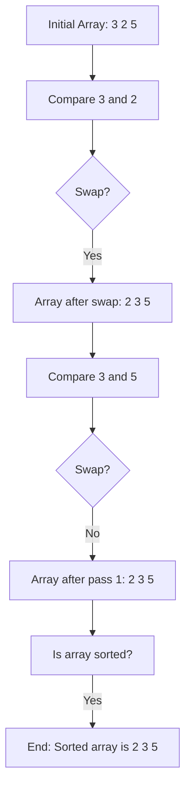
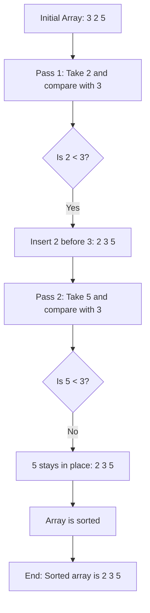
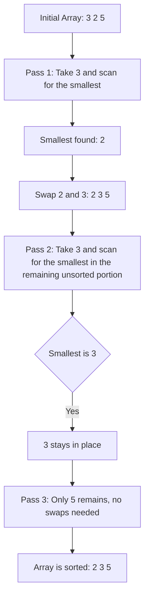
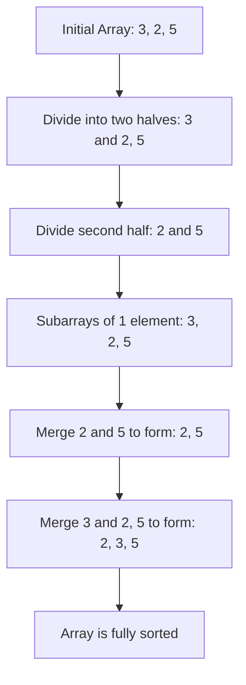
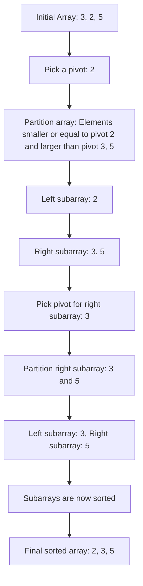

# Sorting Algorithms Demo

## Bubble Sort

This is when you look at the number to the right and check if its greater or less than the number you are on. If it's greater than you continue, if it's less then you swap it:

## Insertion Sort

This is when you look at the elements to the left and compare them, if the element to the left is greater than the element you are on, you shift it to the right. You keep doing this until the current element can be inserted in the correct position because it is greater than or = to that number.

This keeps happening until all the elements are in the correct order.

You start on the second element because there is nothing to the left of the first element.

## Selection sort

This works by scanning the array, searching for the smallest number and swapping it with the first unsorted number. For example [3, 2, 5]. The first unsorted number is 3 and scanning the array 2 is the smallest so 2 would be swapped with 3. This will repeat for everything in the list until everything is sorted.

## Merge sort

This works by dividing the array into halves and sorting then combining the arrays back together again. This is done using recursion to (calling merge_sort inside itself) until we get to arrays with 1 or 0 elements.

## Quick sort 

This works by picking a pivot, partitioning the array into elements smaller and larger than the pivot and then recursively sorting each side.

